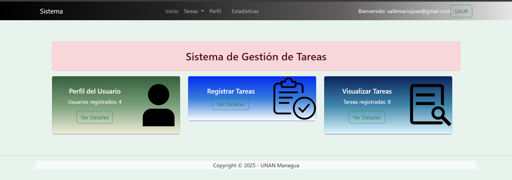
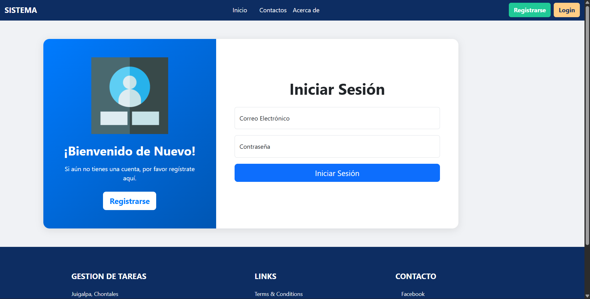

## Intalacion de archivos requeridos

** Crear el archivo **
pip freeze > requeriments.txt

** Instalarlos **
pip install -r requeriments.txt

## Recursos:
Python 3.13.5

microframework web
flask

Gestor de base de datos
Mysql

## Vista principal

## Vista del dashboard

## Vista Login
